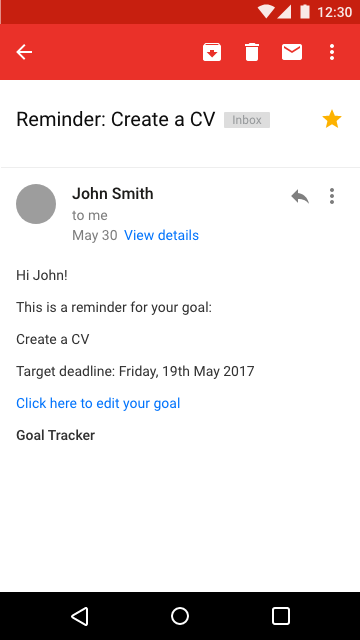

# goalTracker

### Goal Tracker
Goal Tracker is an mobile-designed web app for keeping track of your goals and deadlines. With a focus on using positive reinforcement to promote productivity and a balanced lifestyle, Goal Tracker can be used by anyone, but is aimed particularly at young people who live with depression or low self esteem. Users can also opt to receive email reminders of upcoming target deadlines, to help keep track of their priorities.

[This video demonstration](https://dl.dropboxusercontent.com/u/5038771/GoalTracker%20Demo.mov) demonstrates how the app works.

You can also check the [prototype we built](https://goaltrackerapp.herokuapp.com/) to see for yourself.

Sample email reminder:

Goal Tracker uses a basic reward system to encourage users to be more productive. The user's completed goal-count is displayed in the top corner of the screen. Users are given an image of an animal which is initially obscured, using low-poly distortion. With every task that the user completes, the resolution of the animal image improves to reveal the animal. And for every 10 goals completed, more animal images are unlocked.

Goals are divided into four categories to encourage a healthy consideration for varied lifestyle and work / life balance:

* Productivity
* Learning
* Health
* Leisure

## User Journey
As an unorganised / forgetful individual I want to set, and keep track of my goals in an easy and simple user interface.

**Inspiration**:

Functionality:
* [Evernote](https://evernote.com)
* [Duolingo](https://www.duolingo.com) (Language learning)
* [Couch 2 5K](www.c25kfree.com/) (Running/exercise)
* [Google Calendar](https://www.google.com/calendar) (organization/planning/remainders).
* [http://www.stridesapp.com/](http://www.stridesapp.com/)

**Technology**:
* Hapi.js
* Handlebars
* PostgreSQL
* Sass
* CI with Travis
* oAuth
* [Trianglify](https://github.com/qrohlf/trianglify)

**Resources**
- [https://elements.heroku.com/addons/sendgrid](https://elements.heroku.com/addons/sendgrid)
